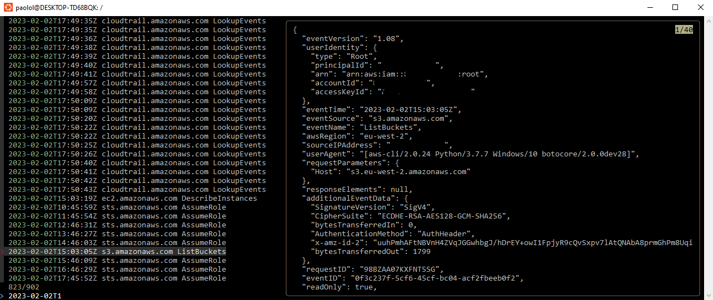

# cloudtrail-event-fuzzy-viewer

cloudtrail-event-fuzzy-viewer is a cli tool that allows you to search for cloudtrail events using fuzzy search 




## Usage

```bash
cloudtrail-event-fuzzy-viewer --start-time "2023-01-30 00:00:00" --end-time "2023-02-03 00:00:00" --region us-east-1
```

or, using docker:

```bash
docker run --rm -it -v ~/.aws:/root/.aws:ro plazzari/cloudtrail-event-fuzzy-viewer:latest --start-time "2023-01-30 00:00:00" --end-time "2023-02-03 00:00:00" --region us-east-1
```

- to scroll the event up and down, use shift+up or shift+down
- to exit, use ctrl+c

## Prerequisites

- [jq](https://github.com/stedolan/jq)
- [awscli](https://github.com/aws/aws-cli)
- [fzf](https://github.com/junegunn/fzf)


## Installation

```bash
$ curl -O https://raw.githubusercontent.com/paololazzari/cloudtrail-event-fuzzy-viewer/master/cloudtrail-event-fuzzy-viewer
$ cp cloudtrail-event-fuzzy-viewer /usr/local/bin/cloudtrail-event-fuzzy-viewer
$ chmod +x /usr/local/bin/cloudtrail-event-fuzzy-viewer
```
